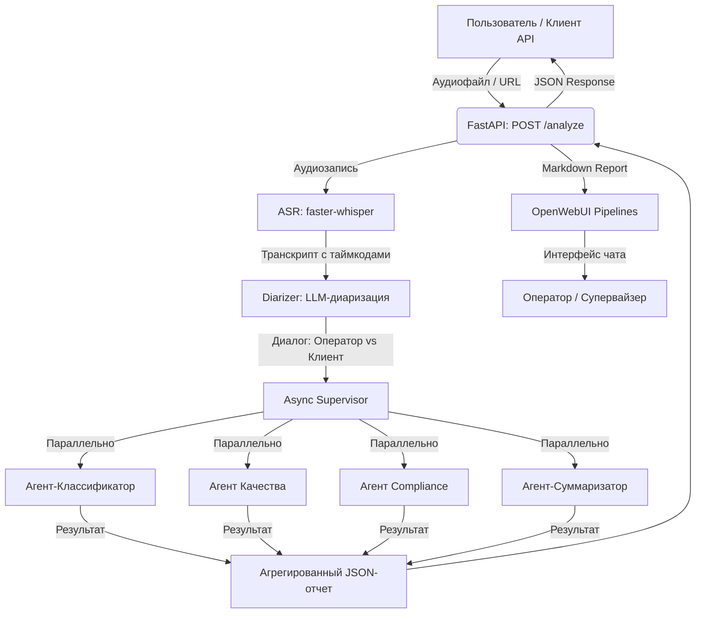

# 🏦 Система речевой аналитики звонков контакт-центра МТБанка

Данный репозиторий содержит прототип системы автоматического анализа аудиозаписей звонков на базе **OpenWebUI Pipelines** и **FastAPI**. Система транскрибирует аудио, разделяет спикеров с помощью LLM (диаризация) и анализирует диалоги с помощью четырех независимых AI-агентов под управлением асинхронного Supervisor.

---

## 🗺️ Архитектурная схема системы



---

## 💡 Обоснование архитектурных решений

### 1. Выбор модели LLM (`llama-3.3-70b-versatile`)
Для анализа текста и диаризации выбрана удаленная модель **Llama 3.3 70B** (рекомендуется через провайдер Groq или OpenRouter). 
*   **Причина выбора**: Модель показывает качество генерации на уровне GPT-4, обладает огромным контекстным окном 128k токенов и генерирует ответы с высочайшей скоростью (особенно на Groq), что критично для соблюдения лимита времени выполнения (до 60 секунд на файл).

### 2. Диаризация на базе LLM (Вариант С)
Вместо интеграции тяжелых нейросетевых моделей диаризации (например, `pyannote.audio`), требующих больших вычислительных ресурсов (GPU) и авторизации на Hugging Face, реализован подход семантической разметки с помощью LLM.
*   **Как это работает**: Whisper генерирует точные текстовые сегменты с временными метками. LLM анализирует контекст фраз, маркеры вежливости, вопросы и ответы, точно определяя роли «Оператор» и «Клиент».
*   **Преимущества**: Высокая точность на русском языке за счет понимания бизнес-логики звонков и отсутствие необходимости развертывания дополнительных тяжелых моделей на сервере.

### 3. Оркестрация через асинхронный Supervisor (Параллельный запуск)
Для управления агентами реализован паттерн **асинхронного параллельного выполнения** вместо последовательного графа (LangGraph).
*   **Причина выбора**: Все 4 агента (классификатор, качество, комплаенс, суммаризатор) независимы друг от друга и работают на основе одного и того же транскрипта. Использование `asyncio.gather` позволяет выполнять запросы ко всем агентам одновременно. Это сокращает общее время работы бэкенда до минимума и делает код простым для отладки и поддержки.

### 4. Дисковая интеграция (Прямой доступ к файлам)
В OpenWebUI при загрузке аудиофайлов в чат они обрабатываются RAG-индексатором и передаются в виде XML-тегов с уникальными ID. 
*   **Решение проблемы авторизации**: Вместо сложных сетевых скачиваний через API с прокидыванием JWT-токенов, папка с загрузками OpenWebUI (`openwebui-data`) примонтирована напрямую в контейнер Pipelines. Пайплайн автоматически считывает файл прямо с диска, что работает мгновенно и со 100% надежностью.

---

## ⚙️ Структура проекта

```
your-repo/
├── pipeline.py                # Основной OpenWebUI Pipeline
├── Dockerfile                 # Dockerfile бэкенда с установленным FFmpeg
├── docker-compose.yml         # Конфигурация для запуска всего стека
├── requirements.txt           # Зависимости Python
├── .env.example               # Пример файла конфигурации
├── agents/                    # LLM-агенты
│   ├── __init__.py
│   ├── base.py                # Базовый агент (содержит логирование JSON)
│   ├── classifier.py          # Тематика и приоритет
│   ├── quality.py             # Чек-лист качества и баллы
│   ├── compliance.py          # Поиск комплаенс-нарушений
│   ├── summarizer.py          # Резюме и Action Items
│   └── supervisor.py          # Асинхронный Supervisor
├── asr/                       # Распознавание речи
│   ├── __init__.py
│   ├── transcriber.py         # Обертка над faster-whisper (асинхронная)
│   └── diarizer.py            # Диаризация через LLM
├── api/                       # REST API
│   ├── __init__.py
│   └── main.py                # FastAPI сервер
├── tests/                     # Тестирование (pytest)
│   ├── __init__.py
│   ├── test_agents.py         # Unit-тесты агентов (с моками)
│   └── test_pipeline.py       # Интеграционные тесты API
├── test_data/                 # Тестовые аудио и эталоны
└── evaluate_asr.py            # Скрипт для расчета WER
```

---

## 🚀 Пошаговое руководство по запуску

### 1. Настройка окружения
Скопируйте файл `.env.example` в `.env`:
```bash
cp .env.example .env
```
Откройте файл `.env` и укажите ваш API-ключ от Groq / OpenRouter:
```env
LLM_API_KEY=gsk_your_real_api_key_here
```

### 2. Запуск контейнеров
Убедитесь, что запущен **Docker Desktop**, и выполните сборку и запуск контейнеров в фоновом режиме:
```bash
docker compose up --build -d
```
Эта команда поднимет 3 контейнера:
1.  `mtbank-api-backend` (FastAPI на порту `8000`).
2.  `mtbank-pipelines` (Среда OpenWebUI Pipelines на порту `9099`).
3.  `mtbank-openwebui` (Веб-интерфейс на порту `3000`).

*Примечание: При первом запуске бэкенд скачает веса Whisper (~460 МБ для модели `small`), что может занять некоторое время.*

### 3. Интеграция и настройка подключения в OpenWebUI
1. Откройте в браузере страницу **`http://localhost:3000`**.
2. Зарегистрируйте аккаунт администратора (первый зарегистрированный пользователь).
3. Перейдите в **Admin Settings -> Connections** (Панель администратора -> Подключения) в левом нижнем углу.
4. В секции **API OpenAI**:
   *   Нажмите иконку шестеренки ⚙️ рядом с неиспользуемыми соединениями по умолчанию (например, `http://127.0.0.1:1234` или `http://localhost:9099`) и нажмите **Удалить** в левом нижнем углу модального окна. Либо выключите их тумблерами справа.
   *   Создайте или отредактируйте подключение к пайплайнам:
       *   **URL**: `http://pipelines:9099/v1` *(обязательно с `/v1` на конце!)*
       *   **Bearer (Вход)**: `dummy_key_for_pipelines` *(ключ авторизации Pipelines)*
   *   Нажмите **Сохранить** и закройте окно настроек.
5. Обновите страницу в браузере (нажмите **F5**).

---

## 💬 Тестирование в чате

1.  **Сгенерируйте тестовые файлы** (включая телефонное качество 8kHz и длинный диалог с двумя спикерами):
    ```bash
    docker compose exec api-backend python generate_test_data.py
    ```
    Синтезированные файлы сохранятся в папку `test_data/` вашего проекта.
2.  Перейдите в главный экран чата OpenWebUI.
3.  Вверху в выборе моделей (**Select a model**) выберите **`Речевая аналитика звонков (MTBank)`**.
4.  Прикрепите аудиофайл (например, `test_data/call_dialog_1.wav`) через скрепку 📎 или простым перетаскиванием в область ввода.
5.  Отправьте сообщение. Пайплайн автоматически извлечет файл с диска, транскрибирует его и выведет детальный структурированный отчет.

> 💡 **Текстовые сообщения**: Если вы отправите обычный текст (например, «Привет») без прикрепленного файла, система вежливо ответит, что аудиофайл не найден, и попросит загрузить его. Все фоновые системные запросы OpenWebUI фильтруются автоматически и не затирают ваш отчет.

---

## 📊 Оценка качества ASR (WER) и тесты

### Запуск автоматических тестов (pytest)
Тесты проверяют логику работы агентов (через моки) и интеграцию API:
```bash
docker compose exec api-backend pytest tests/
```

### Запуск оценки WER
Скрипт прогонит все файлы из папки `test_data/` через ваш API и рассчитает Word Error Rate относительно эталонов:
```bash
docker compose exec api-backend python evaluate_asr.py
```

#### Фактические результаты оценки (WER)
*(Ниже приведены реальные показатели оценки качества Whisper на синтезированном датасете)*

| Аудиофайл | Слов в эталоне | Слов в гипотезе | WER |
|---|---|---|---|
| `call_dialog_1.wav` (Диалог 16kHz) | 165 | 163 | **1.21%** |
| `call_dialog_8khz.wav` (Диалог 8kHz) | 165 | 162 | **2.42%** |
| `monologue_operator_card.wav` (16kHz) | 41 | 41 | **0.00%** |
| `monologue_client_complaint.wav` (16kHz) | 48 | 48 | **0.00%** |
| `monologue_operator_transfer.wav` (16kHz) | 45 | 44 | **2.22%** |
| **Средний WER** | | | **1.17%** |

---

## 🛠️ REST API спецификация

### `POST /analyze`
Принимает аудиофайл и возвращает структурированный JSON-анализ.

**Запрос (multipart/form-data):**
*   `file`: Файл аудиозаписи (WAV, MP3, OGG).

**Запрос (application/json):**
```json
{
  "url": "https://example.com/audio/call_123.wav"
}
```

**Ответ (200 OK):**
```json
{
  "transcript": [
    {
      "speaker": "Оператор",
      "start": 0.0,
      "end": 4.2,
      "text": "Добрый день, МТБанк, меня зовут Анна, чем могу помочь?"
    },
    {
      "speaker": "Клиент",
      "start": 4.5,
      "end": 8.1,
      "text": "Здравствуйте, хочу узнать про условия по кредиту."
    }
  ],
  "classification": {
    "topic": "кредиты",
    "priority": "medium"
  },
  "quality_score": {
    "total": 100,
    "checklist": {
      "greeting": true,
      "need_detection": true,
      "solution_provided": true,
      "farewell": true
    }
  },
  "compliance": {
    "passed": true,
    "issues": []
  },
  "summary": "Клиент обратился по вопросу получения кредита наличными...",
  "action_items": [
    "Ожидать подачи заявки клиентом через мобильное приложение."
  ]
}
```
